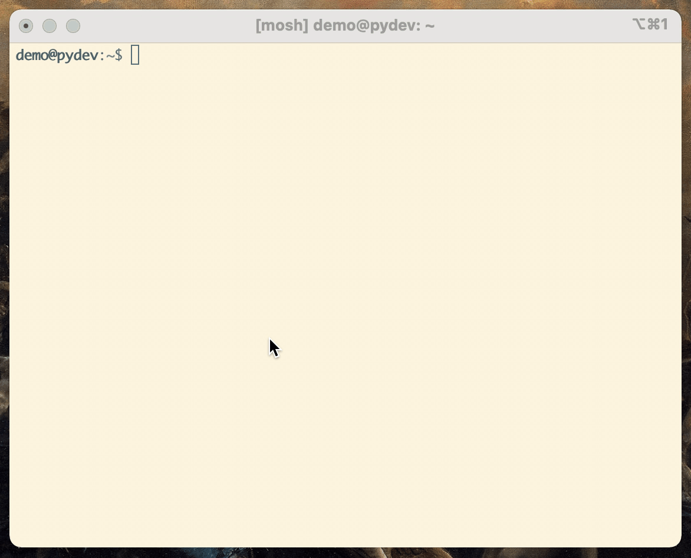

# duck 🦆
An HTML-based URL shortener for static sites.

## Usage

By updating `duck.ini` with the directory containing your Github Pages site (or any other static site), you can use this to quickly generate short URLs for web resources with no nonsense, no tracking, and no credit card required.

`./quack.py <url>` dumps out a small HTML file that contains a meta tag with a Refresh element and a target URL. This will redirect browsers to the provided target URL. The filename is the shorturl of the target resource. 

Optionally, pass the `--slug` argument to use a custom slug. This bypasses the configured slug length in `duck.ini` so you can use whatever you would like.

You can also configure the slug length by updating `duck.ini`.

## Demo
You can see this in action at the following URLs.

https://pid1.pw/duck redirects to https://github.com/pid1/duck

https://pid1.pw/GM redirects to https://youtube.com

https://pid1.pw/fb redirects to https://facebook.com

The Github Pages repository that powers the pid1.pw demo above is available [here](https://github.com/pid1/redirect).
